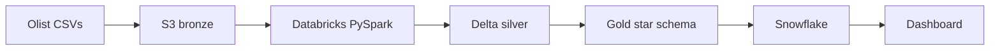
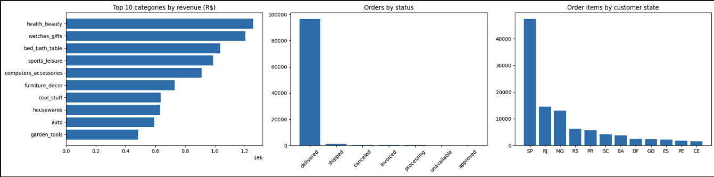

# Cloud-Native Lakehouse Pipeline — Brazilian E-Commerce (Olist)

> This project mirrors the pipeline architecture I would design today for the kind of production and supply-chain data I worked with at HCLTech on the KLA semiconductor account, where pipeline reliability and stakeholder trust mattered more than algorithmic sophistication.

## TL;DR
An end-to-end lakehouse pipeline over 100k+ Brazilian e-commerce orders: raw CSVs land in **AWS S3**, are cleaned into **Delta Lake** tables with **PySpark** on **Databricks**, modelled into a **star schema**, loaded into **Snowflake**, and served as an analytics dashboard. Total cloud spend: **under €1**.

## Architecture

## The medallion layers

| Layer | Tool | What happens |
|---|---|---|
| **Bronze** | AWS S3 | 9 raw Olist CSVs stored untouched — replayable source of truth |
| **Silver** | Databricks + PySpark + Delta | Types corrected, duplicates removed, 7 clean Delta tables |
| **Gold** | Spark SQL | Star schema: `fact_orders` + 4 dimensions (customer, product, seller, date) |
| **Warehouse** | Snowflake | Gold marts loaded for BI querying |
| **Serving** | Dashboard | Executive KPIs, fulfillment, geography |

## Results

| Metric | Value |
|---|---|
| GMV | R$ 13,591,644 |
| Orders | 98,666 |
| Avg review score | 4.04 / 5 |
| Avg delivery time | 12.4 days |

**Key finding — delivery speed drives satisfaction.** São Paulo averages 8.7-day delivery and a 4.13 review score; Bahia averages 19.2 days and 3.82. A ~10-day delivery gap costs roughly 0.3 review points, pointing to regional fulfilment capacity as the highest-leverage investment.

**Other findings:** health & beauty is the top revenue category (~R$1.25M); ~97% of orders reach `delivered`; São Paulo alone accounts for more order items than the next three states combined.

## Data model
Star schema — see `docs/data_model.md`. `fact_orders` holds the measures (price, freight, delivery days, review score) at order-item grain; dimensions hold the descriptive context.

## Engineering decisions
- **Delta Lake over CSV/Parquet** — ACID transactions, time travel, SQL-queryable.
- **Idempotent writes** (`mode("overwrite")`) — the pipeline can be re-run safely any number of times.
- **Deduplication enforced on primary keys** — row counts are proven, not assumed.
- **Explicit timestamp casting** — enables delivery-duration analytics downstream.
- **Least-privilege IAM** — a dedicated read-only key for S3 access.

## Cost log
| Service | Spend |
|---|---|
| AWS S3 (~120 MB) | < €0.01 |
| Databricks Free Edition | €0 |
| Snowflake trial credits | €0 |
| **Total** | **< €1** |

## What I'd do next
- Add a **dbt** layer over silver for modular, tested SQL with lineage docs.
- Add **Great Expectations** checks at the silver layer to halt the pipeline on bad data.
- Orchestrate as a **Databricks Job** DAG with retries, alerts and an ops log table.
- Implement **SCD2** on `dim_customer` to track address history over time.

## Repo structure

